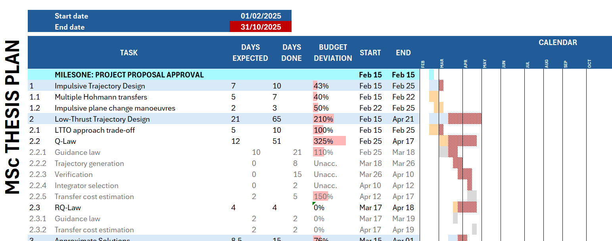
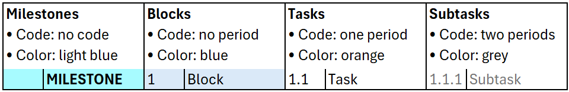
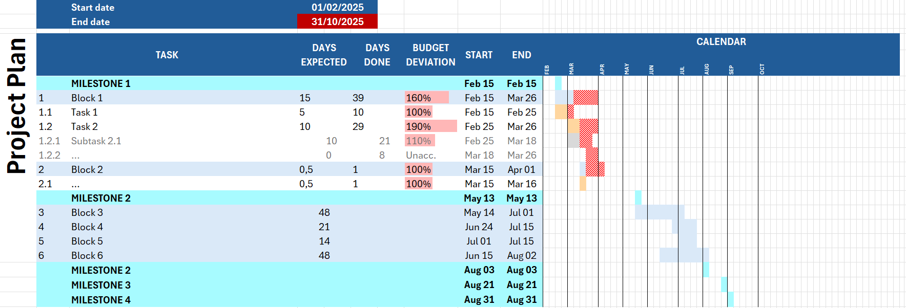

# `gantt.xlsx`

Excel Gantt chart template with automatic:
- Gantt chart plot based on task dates
- Delay highlighting
- Task classification hierarchy
- Month labelling

> Tip: export Gantts to LaTeX with [Tables Generator](https://www.tablesgenerator.com)

## User Guide

This guide can be found in the first sheet of the workbook.

#### Project Duration
From `Start date` to `End date`.

#### Task Hierarchy
Derived from task code:

## Template

© Antonio López Rivera, 2025

---

[Back to top](#gantt-chart-template)
